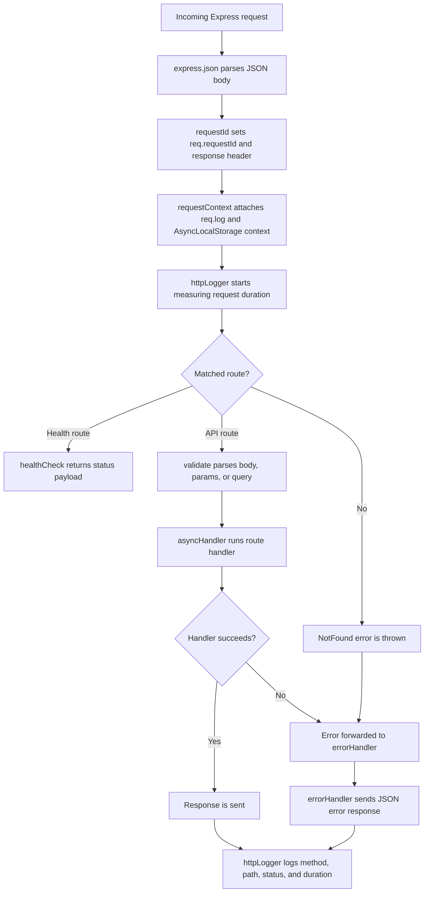

# Workflow

This document explains how `expressentials` helpers work together inside an Express
application. The package is made of small independent utilities, but the middleware
is most useful when mounted in the right order.

## Recommended Middleware Order

```ts
import express from "express";
import {
  requestId,
  requestContext,
  httpLogger,
  validate,
  asyncHandler,
  errorHandler,
  healthCheck,
  Logger,
  NotFound,
} from "expressentials";

const app = express();
const customLogger = new Logger();

app.use(express.json());

app.use(requestId());
app.use(requestContext());
app.use(
  httpLogger({
    skip: (req) => req.url === "/health",
    logger: customLogger,
  }),
);

app.get("/health", healthCheck());

app.post(
  "/users",
  validate({ body: createUserSchema }),
  asyncHandler(async (req, res) => {
    req.log.info({ email: req.body.email }, "Creating user");
    res.status(201).json({ id: "user_123" });
  }),
);

app.use("*", () => {
  throw new NotFound("Route not found");
});

app.use(errorHandler());
```

The recommended order is:

1. Parse request body with `express.json()`.
2. Add a request ID with `requestId()`.
3. Create request-scoped context with `requestContext()`.
4. Log request completion with `httpLogger()`.
5. Register routes, validation, health checks, and async handlers.
6. Handle unmatched routes.
7. Convert thrown errors into JSON responses with `errorHandler()`.

## Request Flow



## Why Order Matters

`requestId()` should run before `requestContext()` because the context stores the
current request ID. If `requestContext()` runs first, the scoped logger may not
include a useful request ID.

`requestContext()` should run before `httpLogger()` when you want request-scoped
logs. In that order, `httpLogger()` uses `req.log`, so each request log can
include context such as the request ID.

`httpLogger()` can also run without `requestContext()`. If `req.log` is missing,
it falls back to the configured logger, or to the package's default `Logger`.

`validate()` should run before the route handler so handlers receive parsed and
validated `req.body`, `req.params`, and `req.query` values.

`asyncHandler()` wraps async route handlers and forwards rejected promises to
Express. This keeps route code clean and lets `errorHandler()` produce the final
JSON error response.

`errorHandler()` should be registered after routes because Express only calls
error-handling middleware when an error reaches the end of the middleware chain.

## How Each Helper Fits

| Helper                            | Role in the workflow                                                                     |
| --------------------------------- | ---------------------------------------------------------------------------------------- |
| `status`                          | Provides named HTTP status code constants.                                               |
| `message`                         | Provides human-readable messages for HTTP statuses.                                      |
| `ApiError` and HTTP error classes | Represent expected API errors with status codes and optional details.                    |
| `requestId()`                     | Adds `req.requestId` and an `x-request-id` response header.                              |
| `requestContext()`                | Adds `req.log` and stores request data in `AsyncLocalStorage`.                           |
| `httpLogger()`                    | Logs method, path, response status, and duration through `req.log` or a fallback logger. |
| `validate()`                      | Parses request data using schema objects such as Zod or Yup-style parsers.               |
| `asyncHandler()`                  | Catches async route errors and passes them to `next()`.                                  |
| `timeout()`                       | Sends a `GatewayTimeout` error if a request takes too long.                              |
| `healthCheck()`                   | Returns a basic service health payload.                                                  |
| `parseQuery()`                    | Converts common query options into sort, filter, and pagination objects.                 |
| `errorHandler()`                  | Converts `ApiError` instances and unexpected errors into JSON responses.                 |

## Typical Error Flow

When route code throws an `ApiError` or one of the predefined HTTP error classes,
`errorHandler()` preserves the status code and message:

```ts
throw new NotFound("User not found");
```

Response:

```json
{
  "error": {
    "message": "User not found",
    "statusCode": 404
  }
}
```

For unexpected errors, `errorHandler()` returns a generic `500` response so
internal implementation details are not leaked to clients.

## Contribution Note

Workflow documentation is a useful contribution for this project because the
README shows how to use each helper individually, while this file explains how
the helpers fit together in a real Express request lifecycle.
